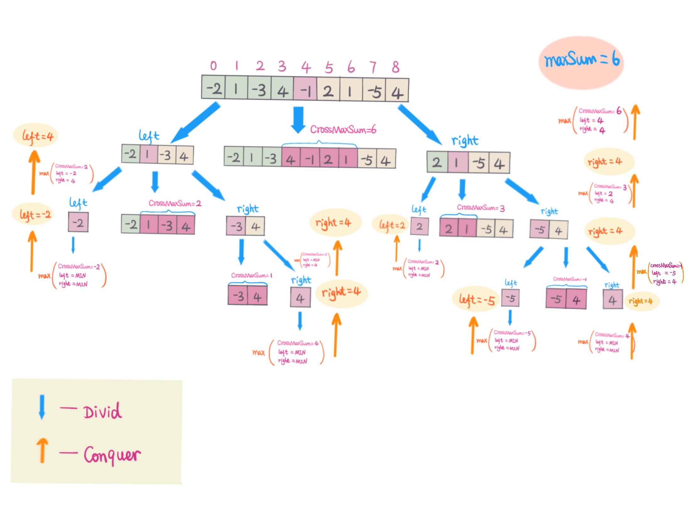

>>53.最大子序和
给定一个整数数组 nums ，找到一个具有最大和的连续子数组（子数组最少包含一个元素），返回其最大和。
示例:
输入: [-2,1,-3,4,-1,2,1,-5,4],
输出: 6
解释: 连续子数组 [4,-1,2,1] 的和最大，为 6。
进阶:
如果你已经实现复杂度为 O(n) 的解法，尝试使用更为精妙的分治法求解。
来源：力扣（LeetCode）
链接：https://leetcode-cn.com/problems/maximum-subarray
著作权归领扣网络所有。商业转载请联系官方授权，非商业转载请注明出处。

### 思路
**1.暴力求解**
1.1.用两个for循环来枚举出首尾和
1.2.用一个for循环来进行比较
***注：***

      时间复杂度最高，空间复杂度最低
**2.前缀和+暴力求解**
2.1.设置一个最大值max，初始化为-Number.MAX_VALUE
2.2.双层循环，内部循环以外部循环的当前位置为初始，每向前走一步与存储的最大值作比较，若大于存储的值，则更新存储的max
***注：***

      上面类似于求出prefix[n]=a[0]+a[1]+⋯+a[n]。然后利用sum[l....r] = prefix[r] - prefix[l-1],在O(1)的时间内求出任意一个前缀和。然后再暴力求解，时间复杂度为O（n^2)
**3.优化前缀和**
3.1.与上面相同，采用类似于创建prefix[n]=a[0]+a[1]+⋯+a[n]的理念，sum为当前prefix的值即 prefix[r](r为当前索引）
3.2.minSum为prefix中现存元素中最小的值
3.3.将保存的maxSum与prefix[r]即sum与minSum的差
3.4.综上可得上面三个步骤可在一次遍历中结束，详见maxSubArray_3
**4.动态规划法**
4.1.动态规划的是首先对数组进行遍历，当前最大连续子序列和为 sum，结果为 ans
4.2.如果 sum > 0，则说明 sum 对结果有增益效果，则 sum 保留并加上当前遍历数字
4.3.如果 sum <= 0，则说明 sum 对结果无增益效果，需要舍弃，则 sum 直接更新为当前遍历数字
4.4.每次比较 sum 和 ans的大小，将最大值置为ans，遍历结束返回结果
时间复杂度：O(n)
**5.分治法**
###### &emsp;分治法采用树的思想进行求解
>>我们把数组nums以中间位置（m)分为左（left)右(right)两部分. 那么有， left = nums[0]...nums[m - 1] 和 right = nums[m + 1]...nums[n-1]

最大子序列和的位置有以下三种情况：

5.1.考虑中间元素nums[m], 跨越左右两部分，这里从中间元素开始，往左求出后缀最大，往右求出前缀最大, 保持连续性。
5.2.不考虑中间元素，最大子序列和出现在左半部分，递归求解左边部分最大子序列和
5.3.不考虑中间元素，最大子序列和出现在右半部分，递归求解右边部分最大子序列和
分别求出三种情况下最大子序列和，三者中最大值即为最大子序列和。


```javascript

function maxSubArray_2(arr){
     const len = arr.length;
     let max = -Number.MAX_VALUE;
     let sum = 0;
     for(let i=0;i<len;i++){
         sum=0;
         for(let j=i;j<len;j++){
             sum+=arr[j];
             if(sum>max){//因为是未排序的数组，所有内部循环，每走一步，都与最大值进行比较
                 max=sum;
             }
         }
     }
     return max;
 }
```

```javascript

 function maxSubArray_3(arr){
     var maxSum=arr[0];
     var sum=0;
     var minSum=0;
     for(let r=0;r<arr.length;r++){
         sum+=arr[r];//即prefix[r]
         maxSum=Math.max(maxSum,sum-minSum);//将当前保存的maxSum与prefix[r]-prefix[l]比较，得到最大值子序和maxSum
         minSum=Math.min(minSum,sum);//保存prefix中前面最小的值即prefix[l]
     }
 }
 ```

 ```javascript
 function maxSubArray_4(arr){
    let ans=arr[0];
    let sum=0;
    for(const elem of arr){
        if(sum>0){//sum>0时，会对当前元素elem进行增加，
            sum+=elem;
        }else{
            sum=elem;//不在乎elem的正负，因为无论它的正负会在下一次循环中决定会不会对后面的结果产生影响
        }
        ans=Math.max(ans,sum);//每一次都要与当前的最大值进行比较，决定是否要更新
    }
 }
 ```